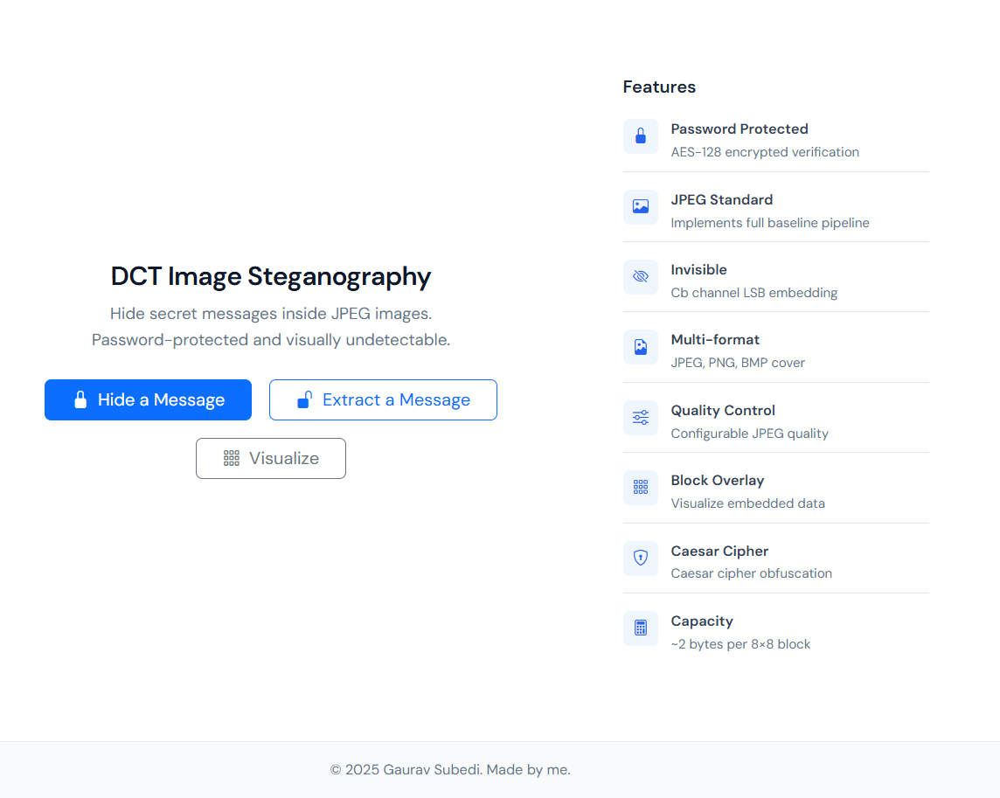
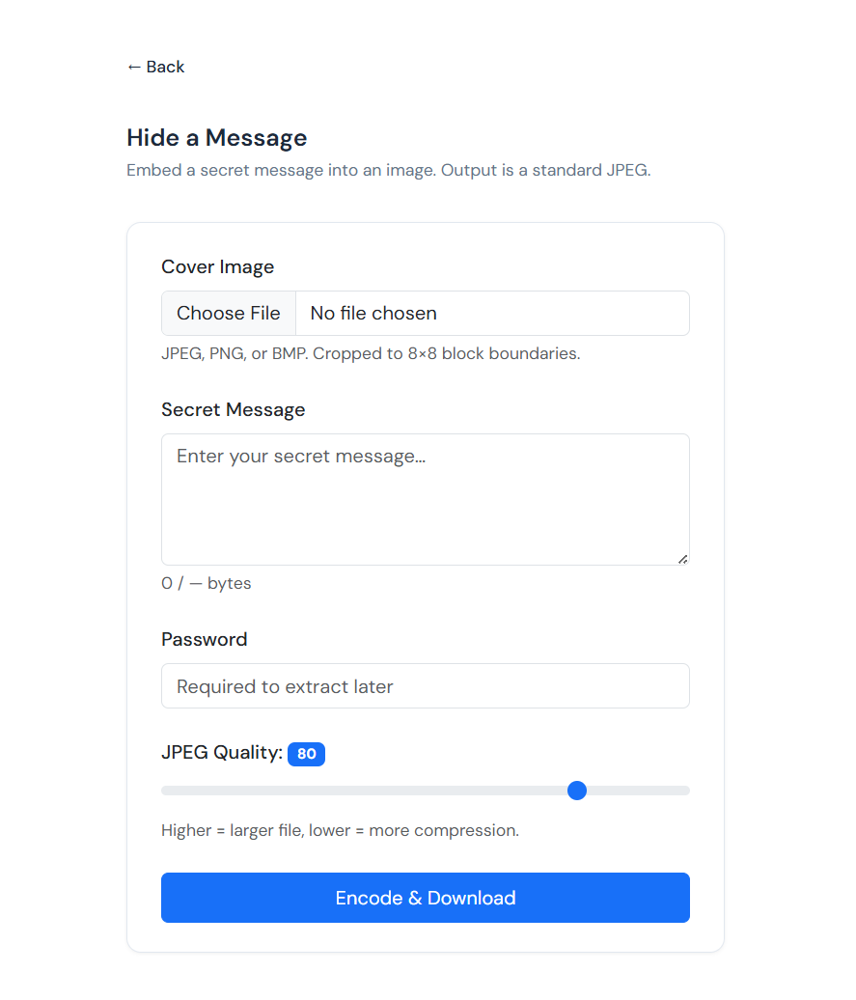
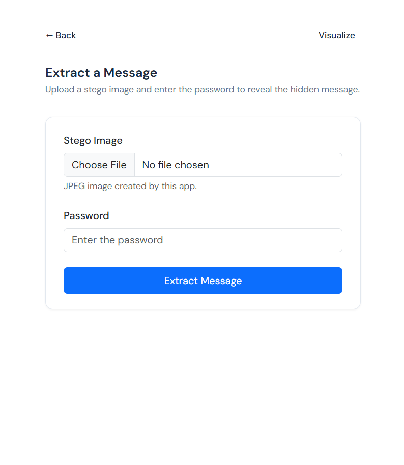

# Image Steganography

A Spring Boot web application for hiding and extracting secret text messages inside JPEG images using DCT (Discrete Cosine Transform) coefficient LSB steganography. The implementation follows the baseline JPEG standard pipeline and embeds data in the Cb chrominance channel for minimal visual impact.

**This project is a reference implementation of the DCT-based JPEG steganography approach presented in my research paper.** It provides a working web application that demonstrates the encoding and decoding pipeline, block-level visualization, and the cryptographic layers (AES for password protection, Caesar cipher for message obfuscation) described in the methodology.

## Research Paper

This implementation is based on the methodology and algorithms described in the [research paper](https://www.researchgate.net/publication/338912933_A_Secure_and_Effective_Pattern-Based_Steganographic_Method_in_Coloured_JPEG_Images).

## Live Demo

**The application is live at [steganography.gauravsubedi.com](https://steganography.gauravsubedi.com)**

Try it out: hide a message in any image, download the stego JPEG, and extract it with your password.

---

## Features

| Feature | Description |
|---------|-------------|
| **Password Protected** | AES-128 encrypted verification — only the correct password can extract the message |
| **JPEG Standard** | Implements full baseline JPEG pipeline; output is a standard, compatible JPEG |
| **Invisible Embedding** | LSB embedding in Cb chrominance channel — visually undetectable to the human eye |
| **Multi-format Cover** | Upload JPEG, PNG, or BMP as cover images; output is always JPEG |
| **Quality Control** | Configurable JPEG quality (1–100) to balance file size and visual fidelity |
| **Block Visualizer** | Visualize where hidden data is stored in the image (no password required) |
| **Message Obfuscation** | Caesar cipher obfuscation before embedding for an extra layer of protection |
| **Capacity Calculator** | ~2 bytes per 8×8 block — e.g. 256×256 image holds up to 2048 bytes |

---

## Screenshots

| Home | Encode | Decode |
|------|--------|--------|
|  |  |  |

---

## Requirements

- **Java 21** or later
- **Maven 3.6+** (or use the included wrapper)

---

## Getting Started

### Run with Maven

```bash
./mvnw spring-boot:run
```

Then open [http://localhost:4000](http://localhost:4000).

### Build JAR

```bash
./mvnw clean package
java -jar target/image-steganography-1.0.0.jar
```

### Run with Docker

```bash
# Build the image
docker build -t image-steganography .

# Run the container (app available at http://localhost:4000)
docker run -p 4000:4000 image-steganography
```

To pass environment variables (e.g. for production crypto keys):

```bash
docker run -p 4000:4000 \
  -e STEGO_AES_KEY="your-16-byte-key!" \
  -e STEGO_AES_IV="your-16-byte-iv!" \
  image-steganography
```

### Linting

The project uses Checkstyle, PMD, and SpotBugs. Run all checks:

```bash
./mvnw verify
```

### Configuration

Crypto keys are set via `.env` (local dev) or environment variables (production). Copy `.env.example` to `.env` and adjust.

| Variable | Description | Default |
|----------|-------------|---------|
| `STEGO_AES_KEY` | AES-128 key (16 bytes) for password encryption | `juccqhjyodhhfymt` |
| `STEGO_AES_IV` | AES-128 IV (16 bytes) for password encryption | `blnzllpshgivhxjk` |
| `STEGO_CAESAR_KEY` | Caesar cipher key for message obfuscation (integer 0–255) | `2` |

---

## Usage

### Encode (Hide a Message)

1. Go to **Hide a Message**
2. Upload a cover image (JPEG, PNG, or BMP)
3. Enter your secret message
4. Set a password (required for extraction)
5. Adjust JPEG quality (1–100) if desired
6. Click **Encode & Download** to save the stego image

### Decode (Extract a Message)

1. Go to **Extract a Message**
2. Upload the stego image
3. Enter the password used during encoding
4. Click **Extract Message** to reveal the hidden text

### Visualize (Block Overlay)

The **Visualize** feature lets you inspect where hidden data is stored in a stego image — no password required.

1. Go to **Visualize**
2. Upload a stego JPEG created by this app
3. Click **Analyze & Visualize**
4. View the analysis: image dimensions, message size, blocks used, capacity, and password protection status
5. See the **block overlay**: each 8×8 block that contains embedded data is highlighted in blue; unused blocks remain unshaded

This helps you understand the DCT-domain embedding: data is stored in the Cb chrominance channel’s mid-frequency coefficients (zigzag positions 25–40). Each block holds up to 2 bytes (16 bits).

---

## Algorithm

See [`docs/algorithm.md`](docs/algorithm.md) for the full specification. Summary:

| Component | Description |
|-----------|-------------|
| **Embedding** | LSB of 16 AC coefficients (zigzag positions 25–40) in the Cb chrominance channel |
| **Patterns** | Four alternating zigzag patterns cycled per MCU to distribute modifications |
| **Message obfuscation** | Caesar cipher obfuscation before embedding (reversible) |
| **Password storage** | AES-128-CBC encrypted, stored in JPEG COM marker (type ID 2) |
| **Metadata** | Message length stored in JPEG COM marker (type ID 1) |

### Capacity

For an image of width × height pixels:

- **MCU count** = (width ÷ 8) × (height ÷ 8)
- **Capacity (bytes)** = MCU count × 2

Example: 256×256 image → 1024 MCUs → **2048 bytes** maximum message length.

---

## Architecture

See [`docs/architecture.md`](docs/architecture.md) for detailed diagrams and data flows.

---

## Project Structure

```markdown
src/main/
├── java/com/steganography/
│   ├── SteganographyApplication.java
│   ├── config/SteganographyConfig.java
│   ├── controller/SteganographyController.java
│   ├── crypto/AESCipher.java, CaesarCipher.java
│   ├── exception/SteganographyException, InvalidPasswordException, ...
│   ├── jpeg/
│   │   ├── common/JpegMarkers, ZigZagOrder, ColorChannel
│   │   ├── encoder/JpegEncoder, ForwardDCT, QuantizationTable, EncoderHuffmanTable
│   │   └── decoder/JpegDecoder, DecoderHuffmanTable, DecoderColorChannel
│   └── service/SteganographyService.java
└── resources/
    ├── static/
    │   ├── css/app.css
    │   └── js/
    │       ├── encode.js
    │       ├── decode.js
    │       └── visualize.js
    └── templates/
```

---

## License

Attribution Required License. You may use, modify, and distribute this software
with appropriate credit to the author. Commercial use and distribution of modified
versions require prior contact with Gaurav Subedi. See [LICENSE](LICENSE) for details.
