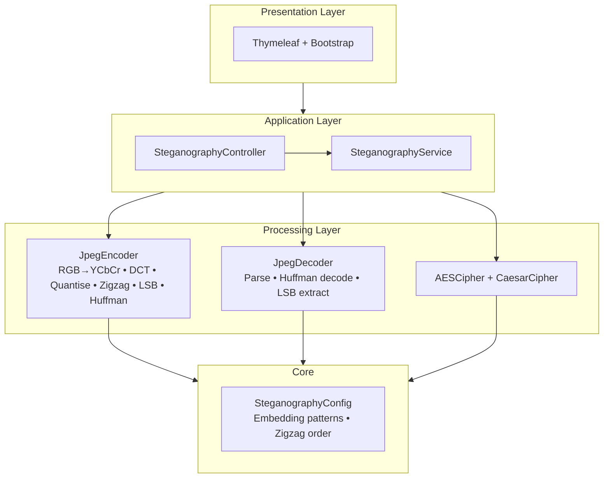
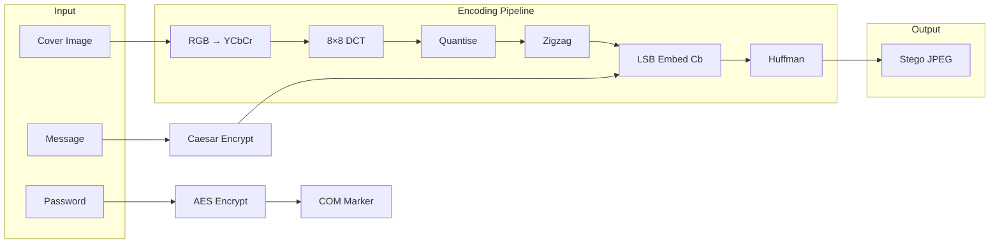
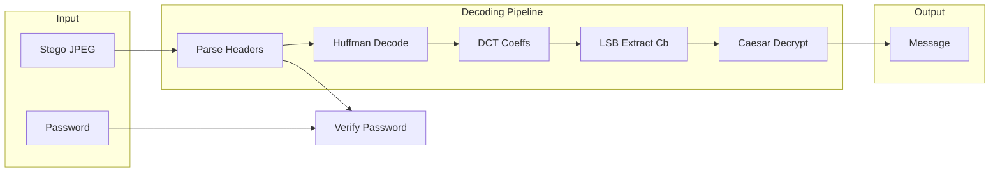
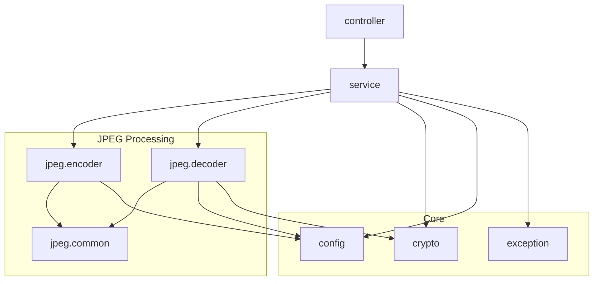

# Architecture

This document describes the layered architecture of the Image Steganography application, including system components, data flows, and package structure.

---

## Overview

The application follows a layered design with clear separation between presentation, application logic, and core processing. All steganography operations run server-side; the web interface provides a thin client for upload, configuration, and download.

| Layer | Responsibility |
|-------|----------------|
| **Presentation** | Thymeleaf templates, Bootstrap UI, static assets |
| **Application** | Request handling, orchestration, validation |
| **Processing** | JPEG encode/decode, DCT, LSB embedding, Huffman |
| **Core** | Configuration, crypto primitives, shared utilities |

---

## System Components

---

## Encoding Pipeline

---

## Decoding Pipeline

---

## Package Structure

| Package | Purpose |
|---------|---------|
| `controller` | HTTP endpoints, form binding, response handling |
| `service` | Business logic, orchestration of encode/decode |
| `jpeg.encoder` | Forward DCT, quantisation, Huffman, LSB embedding |
| `jpeg.decoder` | Huffman decode, LSB extraction, coefficient parsing |
| `jpeg.common` | Markers, zigzag order, colour channels |
| `crypto` | AES-128, Caesar cipher |
| `config` | Embedding patterns, env-based configuration |
| `exception` | Domain exceptions, error handling |

---

## Key Design Decisions

| Decision | Rationale |
|----------|-----------|
| **Cb channel** | Chrominance changes are less perceptible than luminance |
| **Zigzag 25–40** | Mid-frequency AC coefficients balance capacity and robustness |
| **Four patterns** | Cycled per MCU to distribute modifications and reduce detectability |
| **COM markers** | JPEG metadata stores length and encrypted password without altering image data |
| **Server-side processing** | No client-side crypto; keys stay on server; supports large images |
